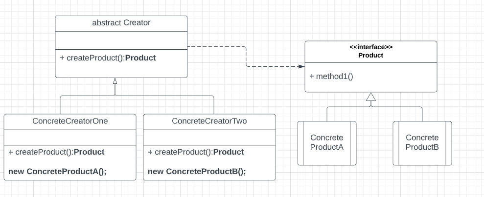

**Factory Method Pattern** 

The pattern is used when we wanted to hide the logic of creation of the Objects (Products).
The _Products_ will implement a common Interface.The classes which call the FactoryMethod are called _Creator_.
The Creator can be an abstract base class having a method for creating _Product_.But the concrete subclasses implementing 
then will have the logic of actual Product creation.

Exercise to showcase Factory Method pattern. 

Car Factory: 

Implement a car factory that creates different types of cars based on user input.
Create classes for Car, SportCar, FamilyCar, and CarFactory.
The Car class should have a method drive() that returns 
a string, and the factory should use the input to determine which type of car to create and return it as an object of 
type Car.
